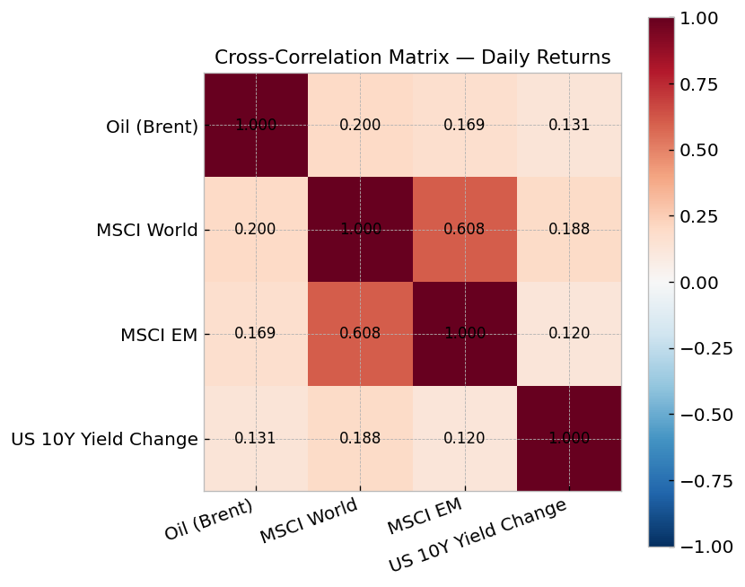
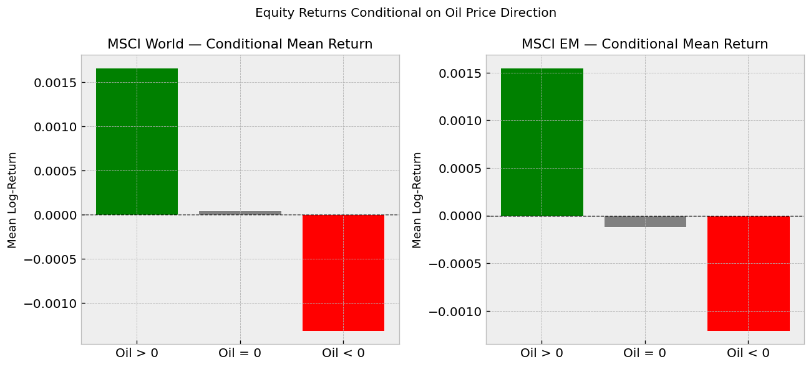
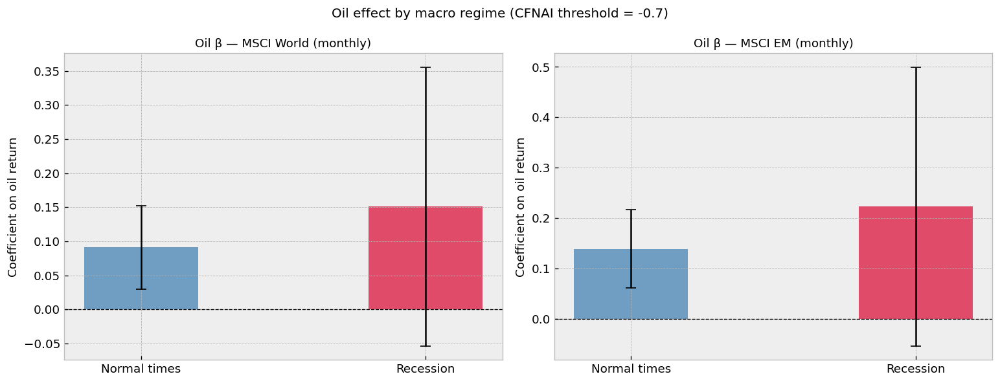
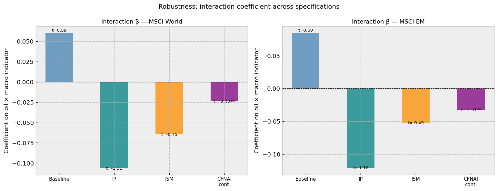
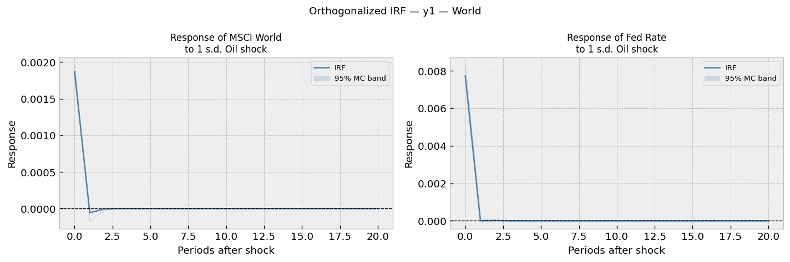
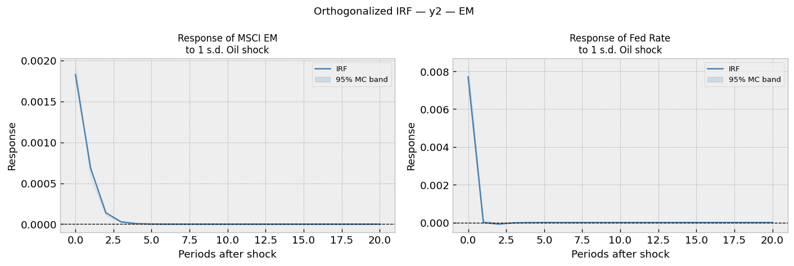
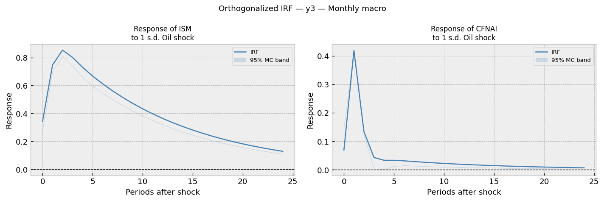
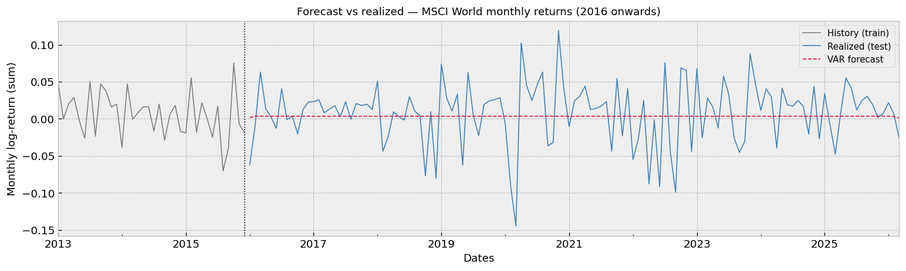

This page summarises the main empirical findings of the study. The full methodology, robustness checks, and references are available in the [PDF report](report/EMIF_oil_equity_report.pdf).

## Data overview

The financial sample covers daily log-returns of Brent crude oil, MSCI World, MSCI Emerging Markets, and US 10-year Treasury yield changes from January 1990 to March 2026 (~9,400 observations). Macroeconomic variables (CFNAI, ISM Manufacturing, Industrial Production) are at monthly frequency (434 observations).

{#fig-corr}

Oil shows moderate positive correlations with both equity indices (0.20 with MSCI World, 0.17 with MSCI EM). The correlation between MSCI World and MSCI EM is 0.61, reflecting global integration of equity markets. Interest rate changes show only weak correlations with the other series.

## Baseline OLS estimates

At daily frequency, oil returns are positively and significantly associated with both equity indices. A 1% increase in oil prices is associated with a 0.077% increase in MSCI World returns and a 0.079% increase in MSCI EM returns (both significant at the 1% level, Newey-West HAC standard errors). The coefficients are nearly identical across the two markets, suggesting that the immediate transmission of oil shocks does not differ meaningfully between developed and emerging markets at the daily horizon. This is **inconsistent** with the common view that emerging markets are more sensitive to oil price fluctuations.

## Asymmetric effects

We decompose oil returns into positive and negative components to test whether equity markets react differently to oil increases and decreases.

{#fig-conditional}

Mean equity returns are positive when oil rises, and negative when oil falls — for both World and EM. Negative oil moves are associated with stronger equity declines (-0.095% for World, -0.097% for EM per 1% oil decline) than positive oil moves push equity up (+0.056% and +0.059%). However, a formal Wald test fails to reject the null of equal coefficients (t = −1.17 for World, t = −1.01 for EM), so we cannot statistically confirm asymmetry at the 5% level.

The stronger reaction to negative oil shocks likely reflects episodes of joint distress — when both oil and equity markets fall together as part of broader demand-driven downturns.

## State-dependent effects (recession interaction)

We introduce a CFNAI-based recession dummy (threshold: −0.7, following Brave 2009) to test whether oil shocks have a stronger impact during periods of economic weakness.

{#fig-regime}

The point estimates suggest a stronger oil effect during recessions (0.151 vs 0.091 for World; 0.223 vs 0.139 for EM), but the interaction term is **not** statistically significant (t = 0.59 for World, t = 0.60 for EM). The wide error bars during recessions reflect the small number of recession months in the sample (35 out of 434).

### Robustness across macro indicators

We re-estimate the interaction model using alternative measures of economic weakness:

{#fig-robustness}

Results are highly sensitive to the choice of indicator. Only the **continuous CFNAI** specification yields a significant interaction (t = −2.12 for World, t = −2.51 for EM), and the sign is negative — opposite to what the binary recession dummy suggested. The IP and ISM dummies yield insignificant negative coefficients. This sensitivity reveals a deeper conclusion: there is **no robust evidence** that oil shocks are amplified during downturns.

## Dynamic transmission (VAR + IRF)

We estimate two daily VAR systems (one for World, one for EM) with oil ordered first in the Cholesky decomposition, plus a monthly macro VAR with oil → ISM → CFNAI.

### Impulse responses — developed markets

{#fig-irf-world}

The MSCI World response to an oil shock is positive on impact (~0.18%), statistically significant only at horizon 0, and reverts to zero within a single day. The half-life is approximately one day. This rapid mean-reversion is consistent with the efficient market hypothesis: oil news is rapidly incorporated into equity prices.

### Impulse responses — emerging markets

{#fig-irf-em}

The MSCI EM response is essentially identical to the World response: same magnitude on impact, same rapid reversion. Despite the higher Granger causality F-statistic for EM (F = 5.95 vs F = 4.90 for World), the structural impulse response does not show meaningfully greater sensitivity. **Emerging markets are not statistically more exposed to oil shocks than developed markets in this framework.**

### Macroeconomic transmission

{#fig-irf-macro}

In contrast to the short-lived equity response, oil shocks transmit to the real economy more persistently. The ISM Manufacturing index peaks at ~0.8 within 2–3 months and remains positive for 15–20 months. The CFNAI response is sharper but shorter, peaking within one month and quickly fading.

The **positive** direction of the ISM and CFNAI responses is informative: oil price increases are associated with improvements in industrial activity, consistent with a demand-driven interpretation of oil shocks (Kilian 2009). This is also consistent with our finding that we do **not** observe an amplified equity response in recessions: if oil increases reflect demand strength rather than supply pressure, there is no reason to expect them to amplify equity declines in downturns.

## Out-of-sample forecasting

We split the sample into a training period (1990–2015) and a test period (2016 onwards) to evaluate the practical predictive power of oil-augmented VAR models.

{#fig-forecast-msci}

The forecast (red dashed) flatlines near the unconditional mean of returns. Realised returns (blue) display substantial volatility around this flat forecast. The RMSE of the VAR is 0.0095, virtually identical to the realised standard deviation of 0.0094 — meaning the model provides **no improvement** over simply forecasting the historical mean.

This result is consistent with Welch & Goyal (2008): in-sample statistical significance does not translate into out-of-sample predictive value for equity premium models. The macro VAR yields similar results (RMSE/std ratios of 1.07 for ISM and 1.72 for CFNAI), the latter heavily affected by the unforecasted COVID-19 shock of April 2020.

## Summary

| Hypothesis tested | Verdict |
|---|---|
| Oil shocks amplify in recessions | **Not supported** (sensitive to indicator choice, no robust evidence) |
| Emerging markets more exposed than developed markets | **Not supported** (near-identical impulse responses) |
| Negative oil moves have stronger impact than positive | **Weakly supported** (point estimates differ but Wald test fails) |
| Oil shocks transmit to the real economy | **Supported** (persistent ISM response, ~20 months) |
| Oil-based forecasts beat the historical mean | **Not supported** (RMSE essentially equal) |

The dominant interpretation that emerges from these results is that oil price movements over 1990–2026 have been primarily **demand-driven** rather than supply-driven, consistent with Kilian (2009). Under this interpretation, oil increases coincide with global growth episodes, transmit positively (and briefly) to equities, and persistently to manufacturing activity — but do not generate the asymmetric recession amplification that supply-shock theories would predict.

For the full set of regressions, diagnostic tests, and references, see the [complete report](report/EMIF_oil_equity_report.pdf).